This R Notebook is the complement to my blog post [Benchmarking Modern GPUs for Maximum Cloud Cost Efficiency in Deep Learning](http://minimaxir.com/2017/11/benchmark-gpus/).

This notebook is licensed under the MIT License. If you use the code or data visualization designs contained within this notebook, it would be greatly appreciated if proper attribution is given back to this notebook and/or myself. Thanks! :)

# Setup

```{r}
library(scales)
library(tidyverse)
library(RColorBrewer)

sessionInfo()
```

Set ggplot2 theme.

```{r}
theme_set(theme_minimal(base_size=9, base_family="Source Sans Pro") +
            theme(plot.title = element_text(size=11, family="Source Sans Pro Bold"),
                  axis.title.x = element_blank(),
                  axis.title.y = element_blank(),
                  plot.subtitle = element_text(family="Source Sans Pro Semibold", color="#969696"),
                  plot.caption = element_text(size=6, color="#969696"),
                  axis.text.x = element_text(size = 7),
                  legend.position="none"))
```

```{r}
relative <- function(x) {
  lab <- paste0(sprintf("%.2f", x), 'x')
}
```

Set known price rates from [Google Compute Engine Pricing](https://cloud.google.com/compute/pricing).

```{r}
standard_cost_hr <- 0.0475
k80_cost_hr <- 0.450
p100_cost_hr <- 1.460
cpu16_cost_hr <- 0.120
```

Derive the remaining rates, in seconds.

```{r}
k80_cost_s <- (k80_cost_hr + standard_cost_hr) / 3600
p100_cost_s <- (p100_cost_hr + standard_cost_hr) / 3600
cpu16_cost_s <- cpu16_cost_hr / 3600
cpu32_cost_s <- cpu16_cost_s * 2

# works like a Python dict
costs <- c(k80=k80_cost_s, p100=p100_cost_s, cpu16=cpu16_cost_s, cpu32=cpu32_cost_s)
```

# Analysis

Create a helper function to return the results for all permutations of a given test file name.

```{r}
# frameworks <- c('tensorflow','cntk')
# platforms <- c("p100", "k80", "cpu32", "cpu16")
labels <- c('p100-tensorflow','p100-cntk', 'k80-tensorflow','k80-cntk', 'cpu32-tensorflow','cpu16-tensorflow')


process_test_data <- function(file_name) {
  base_label <- 'k80-tensorflow'
  label_split <- str_split(base_label, "-")[[1]]
  label_str <- paste(label_split[1], label_split[2], sep="\n")
  results <- read_csv(sprintf("../logs/%s/%s_%s.csv", label_split[1], file_name, label_split[2]), col_types = cols()) %>%
              mutate(platform = label_split[1], framework = label_split[2]) %>%
              group_by(platform, framework) %>%
              summarize(total_time = sum(elapsed),
                        total_cost = total_time * costs[label_split[1]]) %>%
              mutate(label = label_str)
  
  base_total_time <- results %>% pull(total_time)
  base_total_cost <- results %>% pull(total_cost)
  
  labels_tf <- labels[!(labels %in% base_label)]
  
  for(i in 1:length(labels_tf)) {
      label = labels_tf[i]
      label_split <- str_split(label, "-")[[1]]
      label_str <- paste(label_split[1], label_split[2], sep="\n")

       temp_df <- read_csv(sprintf("../logs/%s/%s_%s.csv", label_split[1], file_name, label_split[2]), col_types = cols()) %>%
              mutate(platform = label_split[1],
                     framework = label_split[2]) %>%
              group_by(platform, framework) %>%
              summarize(total_time = sum(elapsed),
                        total_cost = total_time * costs[label_split[1]]) %>%
              ungroup() %>%
              mutate(label = label_str)
      
      results <- results %>% bind_rows(temp_df)
      
    }

  # Normalize
  results_final <- results %>%
              as_tibble() %>%
              mutate(total_time_norm = total_time / base_total_time,
                     total_cost_norm = total_cost / base_total_cost,
                     label = as_factor(label)
              )
  
  return(results_final)
  
}

process_test_data('cifar10_cnn')
```

## IMDB Bidirectional LSTM

```{r}
df_imdb_lstm <- process_test_data("imdb_bidirectional_lstm")

df_imdb_lstm
```

```{r}
plot <- ggplot(df_imdb_lstm, aes(x=fct_rev(label), y=total_time_norm, fill=platform)) +
          geom_bar(stat="identity") +
          geom_hline(yintercept = 1, linetype="dashed", color="#1a1a1a") +
          geom_text(aes(label = relative(total_time_norm), color=platform), vjust=-0.2, family="Source Sans Pro Bold", size=3) +
          
          scale_y_continuous(labels = relative) +
          scale_fill_hue(l=50) +
          scale_color_hue(l=50) +
          labs(title = "Benchmarking Speed of Training Bidirectional LSTMs",
               x = "Platform",
               subtitle = "Total Model Training Time, Relative to TensorFlow on K80 GPU",
               caption = "Max Woolf — minimaxir.com")

ggsave("dl-cpu-gpu-1.png", plot, width=4, height=3)
```

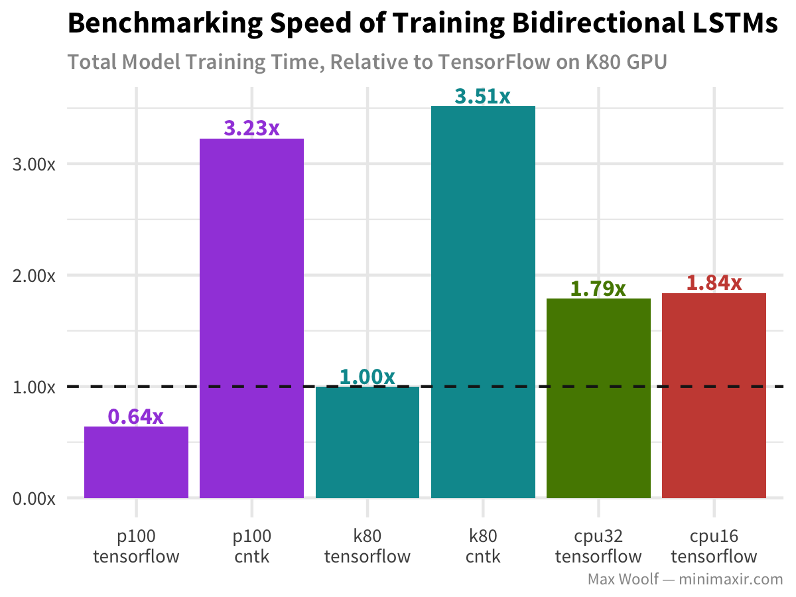

```{r}
plot <- ggplot(df_imdb_lstm, aes(x=fct_rev(label), y=total_cost_norm, fill=platform)) +
          geom_bar(stat="identity") +
          geom_hline(yintercept = 1, linetype="dashed", color="#1a1a1a") +
          geom_text(aes(label = relative(total_cost_norm), color=platform), vjust=-0.2, family="Source Sans Pro Bold", size=3) +

          scale_y_continuous(labels = relative) +
          scale_fill_hue(l=50) +
          scale_color_hue(l=50) +
          labs(title = "Benchmarking Cost of Training Bidirectional LSTMs",
               x = "Platform",
               subtitle = "Total Model Training Cost, Relative to TensorFlow on K80 GPU",
               caption = "Max Woolf — minimaxir.com")

ggsave("dl-cpu-gpu-2.png", plot, width=4, height=3)
```

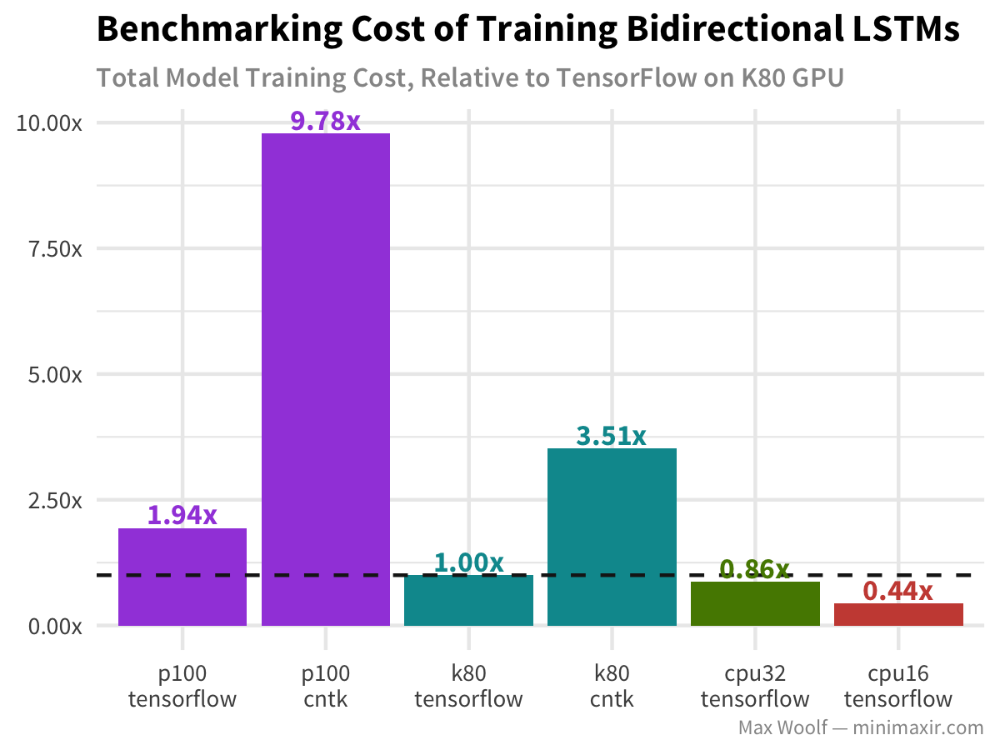

## IMDB Fasttext

```{r}
df_imdb_fasttext <- process_test_data("imdb_fasttext")

df_imdb_fasttext
```

```{r}
plot <- ggplot(df_imdb_fasttext, aes(x=fct_rev(label), y=total_time_norm, fill=platform)) +
          geom_bar(stat="identity") +
          geom_hline(yintercept = 1, linetype="dashed", color="#1a1a1a") +
          geom_text(aes(label = relative(total_time_norm), color=platform), vjust=-0.2, family="Source Sans Pro Bold", size=3) +
          
          scale_y_continuous(labels = relative) +
          scale_fill_hue(l=50) +
          scale_color_hue(l=50) +
          labs(title = "Benchmarking Speed of Training fasttext",
               x = "Platform",
               subtitle = "Total Model Training Time, Relative to TensorFlow on K80 GPU",
               caption = "Max Woolf — minimaxir.com")

ggsave("dl-cpu-gpu-3.png", plot, width=4, height=3)
```

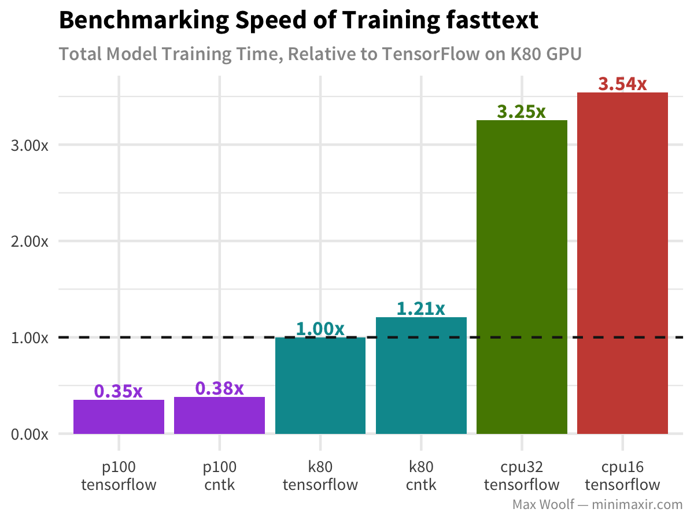

```{r}
plot <- ggplot(df_imdb_fasttext, aes(x=fct_rev(label), y=total_cost_norm, fill=platform)) +
          geom_bar(stat="identity") +
          geom_hline(yintercept = 1, linetype="dashed", color="#1a1a1a") +
          geom_text(aes(label = relative(total_cost_norm), color=platform), vjust=-0.2, family="Source Sans Pro Bold", size=3) +

          scale_y_continuous(labels = relative) +
          scale_fill_hue(l=50) +
          scale_color_hue(l=50) +
          labs(title = "Benchmarking Cost of Training fasttext",
               x = "Platform",
               subtitle = "Total Model Training Cost, Relative to TensorFlow on K80 GPU",
               caption = "Max Woolf — minimaxir.com")

ggsave("dl-cpu-gpu-4.png", plot, width=4, height=3)
```

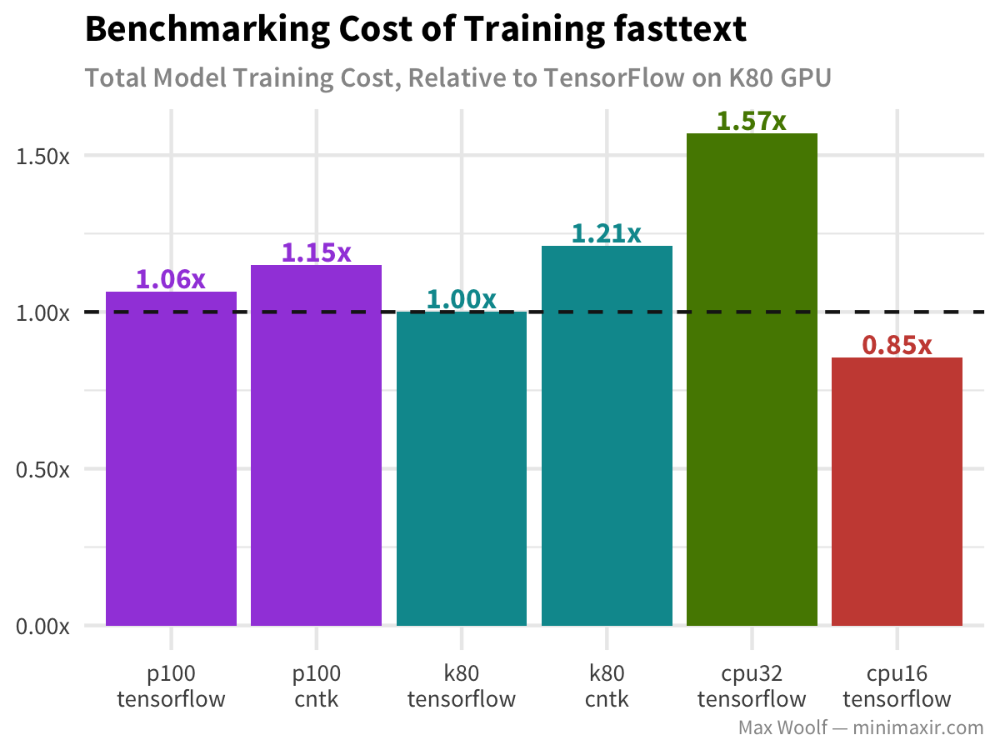

## MNIST MLP

```{r}
df_mnist_mlp <- process_test_data("mnist_mlp")

df_mnist_mlp
```

```{r}
plot <- ggplot(df_mnist_mlp, aes(x=fct_rev(label), y=total_time_norm, fill=platform)) +
          geom_bar(stat="identity") +
          geom_hline(yintercept = 1, linetype="dashed", color="#1a1a1a") +
          geom_text(aes(label = relative(total_time_norm), color=platform), vjust=-0.2, family="Source Sans Pro Bold", size=3) +
          
          scale_y_continuous(labels = relative) +
          scale_fill_hue(l=50) +
          scale_color_hue(l=50) +
          labs(title = "Benchmarking Speed of Training MLP for MNIST",
               x = "Platform",
               subtitle = "Total Model Training Time, Relative to TensorFlow on K80 GPU",
               caption = "Max Woolf — minimaxir.com")

ggsave("dl-cpu-gpu-5.png", plot, width=4, height=3)
```

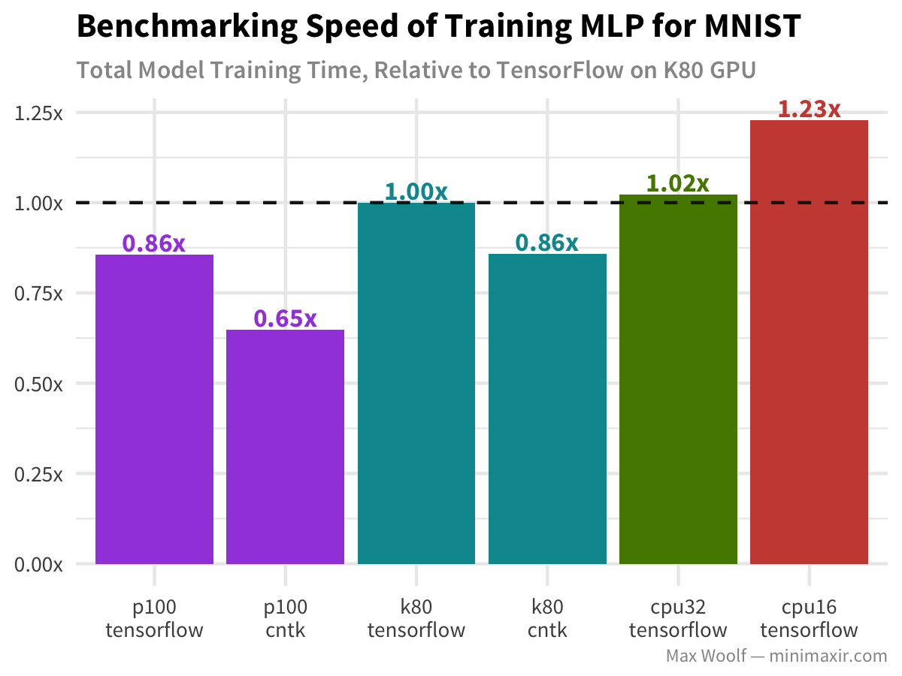

```{r}
plot <- ggplot(df_mnist_mlp, aes(x=fct_rev(label), y=total_cost_norm, fill=platform)) +
          geom_bar(stat="identity") +
          geom_hline(yintercept = 1, linetype="dashed", color="#1a1a1a") +
          geom_text(aes(label = relative(total_cost_norm), color=platform), vjust=-0.2, family="Source Sans Pro Bold", size=3) +

          scale_y_continuous(labels = relative) +
          scale_fill_hue(l=50) +
          scale_color_hue(l=50) +
          labs(title = "Benchmarking Cost of Training MLP for MNIST",
               x = "Platform",
               subtitle = "Total Model Training Cost, Relative to TensorFlow on K80 GPU",
               caption = "Max Woolf — minimaxir.com")

ggsave("dl-cpu-gpu-6.png", plot, width=4, height=3)
```

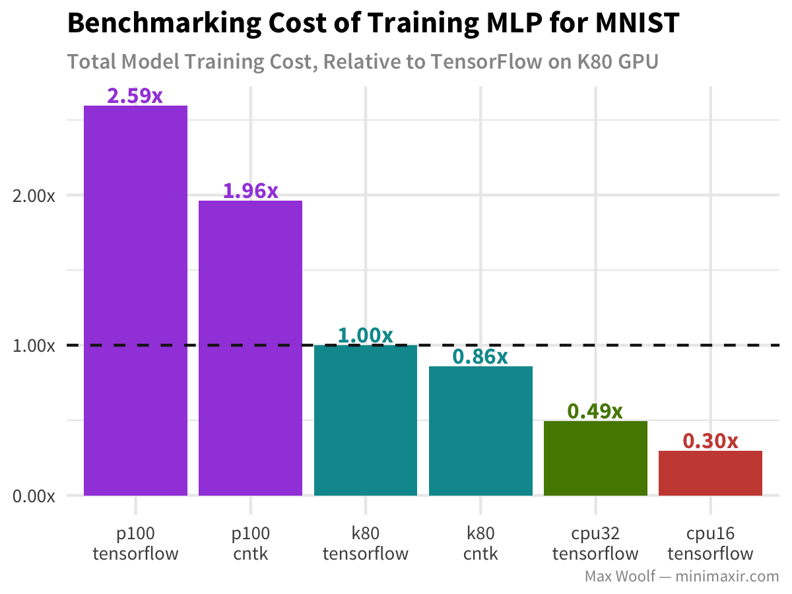

## MNIST CNN

```{r}
df_mnist_cnn <- process_test_data("mnist_cnn")

df_mnist_cnn
```

```{r}
plot <- ggplot(df_mnist_cnn, aes(x=fct_rev(label), y=total_time_norm, fill=platform)) +
          geom_bar(stat="identity") +
          geom_hline(yintercept = 1, linetype="dashed", color="#1a1a1a") +
          geom_text(aes(label = relative(total_time_norm), color=platform), vjust=-0.2, family="Source Sans Pro Bold", size=3) +
          
          scale_y_continuous(labels = relative) +
          scale_fill_hue(l=50) +
          scale_color_hue(l=50) +
          labs(title = "Benchmarking Speed of Training CNN for MNIST",
               x = "Platform",
               subtitle = "Total Model Training Time, Relative to TensorFlow on K80 GPU",
               caption = "Max Woolf — minimaxir.com")

ggsave("dl-cpu-gpu-7.png", plot, width=4, height=3)
```

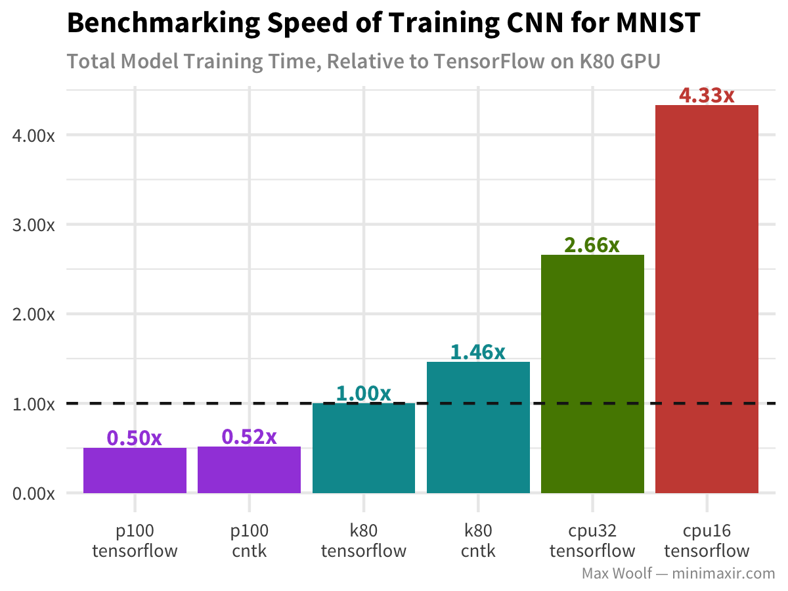

```{r}
plot <- ggplot(df_mnist_cnn, aes(x=fct_rev(label), y=total_cost_norm, fill=platform)) +
          geom_bar(stat="identity") +
          geom_hline(yintercept = 1, linetype="dashed", color="#1a1a1a") +
          geom_text(aes(label = relative(total_cost_norm), color=platform), vjust=-0.2, family="Source Sans Pro Bold", size=3) +

          scale_y_continuous(labels = relative) +
          scale_fill_hue(l=50) +
          scale_color_hue(l=50) +
          labs(title = "Benchmarking Cost of Training CNN for MNIST",
               x = "Platform",
               subtitle = "Total Model Training Cost, Relative to TensorFlow on K80 GPU",
               caption = "Max Woolf — minimaxir.com")

ggsave("dl-cpu-gpu-8.png", plot, width=4, height=3)
```

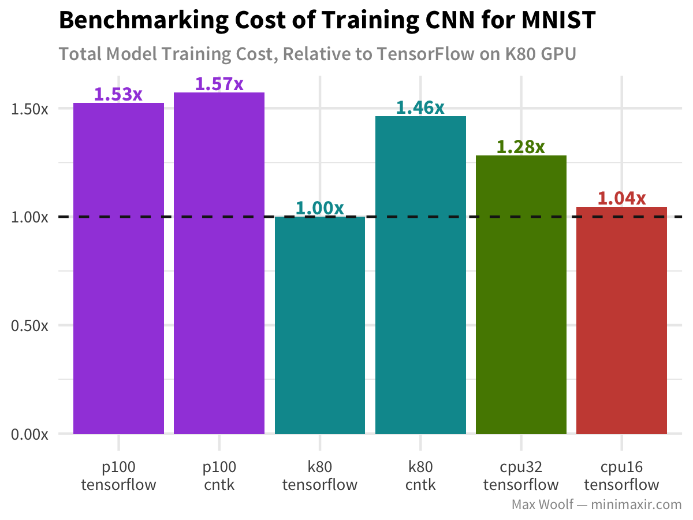

## CIFAR10 Deep CNN + MLP

```{r}
df_cifar10_cnn <- process_test_data("cifar10_cnn")

df_cifar10_cnn
```

```{r}
plot <- ggplot(df_cifar10_cnn, aes(x=fct_rev(label), y=total_time_norm, fill=platform)) +
          geom_bar(stat="identity") +
          geom_hline(yintercept = 1, linetype="dashed", color="#1a1a1a") +
          geom_text(aes(label = relative(total_time_norm), color=platform), vjust=-0.2, family="Source Sans Pro Bold", size=3) +
          
          scale_y_continuous(labels = relative) +
          scale_fill_hue(l=50) +
          scale_color_hue(l=50) +
          labs(title = "Benchmark Speed of Training MLP + CNN for CIFAR10",
               x = "Platform",
               subtitle = "Total Model Training Time, Relative to TensorFlow on K80 GPU",
               caption = "Max Woolf — minimaxir.com")

ggsave("dl-cpu-gpu-9.png", plot, width=4, height=3)
```


```{r}
plot <- ggplot(df_cifar10_cnn, aes(x=fct_rev(label), y=total_cost_norm, fill=platform)) +
          geom_bar(stat="identity") +
          geom_hline(yintercept = 1, linetype="dashed", color="#1a1a1a") +
          geom_text(aes(label = relative(total_cost_norm), color=platform), vjust=-0.2, family="Source Sans Pro Bold", size=3) +

          scale_y_continuous(labels = relative) +
          scale_fill_hue(l=50) +
          scale_color_hue(l=50) +
          labs(title = "Benchmark Cost of Training MLP + CNN for CIFAR10",
               x = "Platform",
               subtitle = "Total Model Training Cost, Relative to TensorFlow on K80 GPU",
               caption = "Max Woolf — minimaxir.com")

ggsave("dl-cpu-gpu-10.png", plot, width=4, height=3)
```

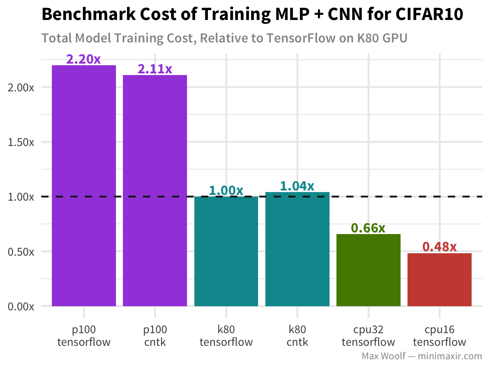

## LSTM Text Generation

```{r}
df_lstm_text <- process_test_data("lstm_text_generation")

df_lstm_text
```

```{r}
plot <- ggplot(df_lstm_text, aes(x=fct_rev(label), y=total_time_norm, fill=platform)) +
          geom_bar(stat="identity") +
          geom_hline(yintercept = 1, linetype="dashed", color="#1a1a1a") +
          geom_text(aes(label = relative(total_time_norm), color=platform), vjust=-0.2, family="Source Sans Pro Bold", size=3) +
          
          scale_y_continuous(labels = relative) +
          scale_fill_hue(l=50) +
          scale_color_hue(l=50) +
          labs(title = "Benchmarking Speed of Training LSTM Text Generator",
               x = "Platform",
               subtitle = "Total Model Training Time, Relative to TensorFlow on K80 GPU",
               caption = "Max Woolf — minimaxir.com")

ggsave("dl-cpu-gpu-11.png", plot, width=4, height=3)
```

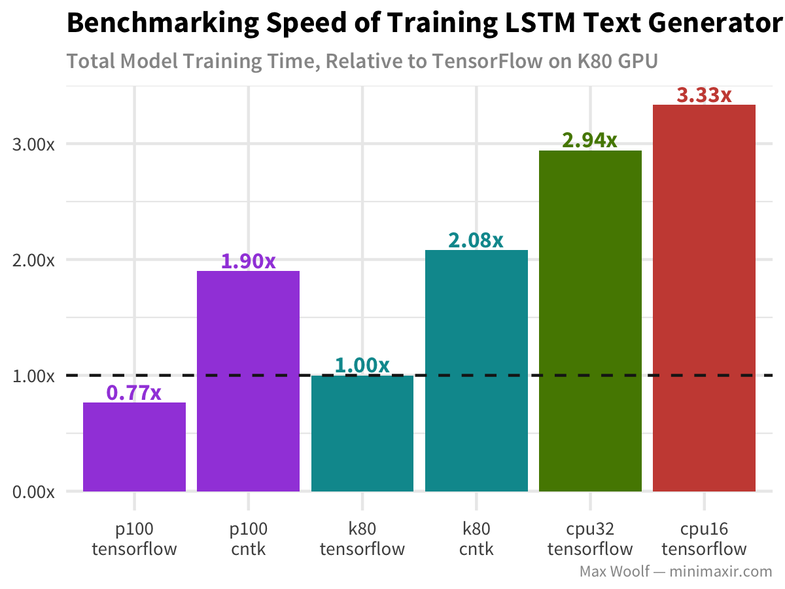

```{r}
plot <- ggplot(df_lstm_text, aes(x=fct_rev(label), y=total_cost_norm, fill=platform)) +
          geom_bar(stat="identity") +
          geom_hline(yintercept = 1, linetype="dashed", color="#1a1a1a") +
          geom_text(aes(label = relative(total_cost_norm), color=platform), vjust=-0.2, family="Source Sans Pro Bold", size=3) +

          scale_y_continuous(labels = relative) +
          scale_fill_hue(l=50) +
          scale_color_hue(l=50) +
          labs(title = "Benchmarking Cost of Training LSTM Text Generator",
               x = "Platform",
               subtitle = "Total Model Training Cost, Relative to TensorFlow on K80 GPU",
               caption = "Max Woolf — minimaxir.com")

ggsave("dl-cpu-gpu-12.png", plot, width=4, height=3)
```

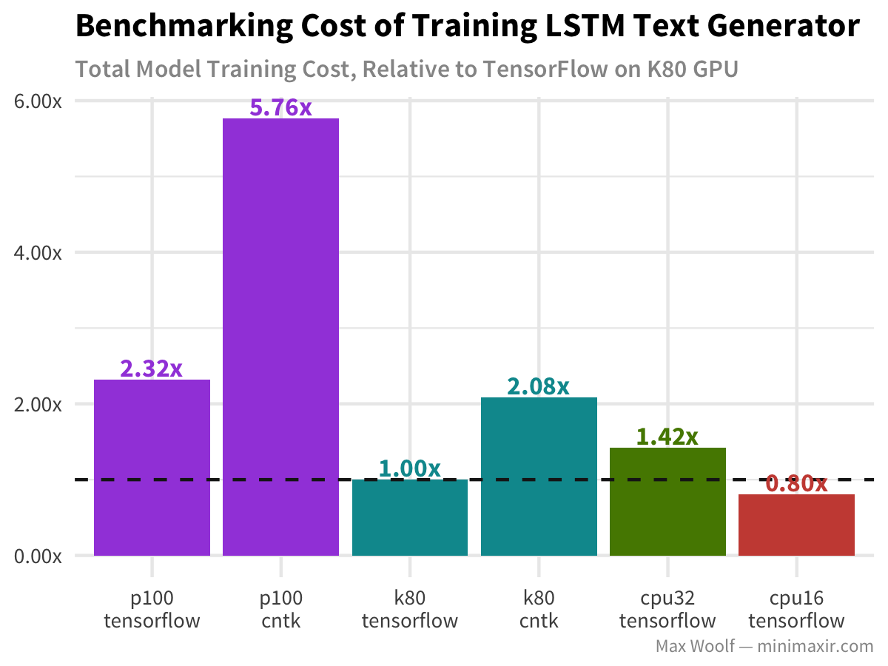

## LICENSE

MIT License

Copyright (c) 2017 Max Woolf

Permission is hereby granted, free of charge, to any person obtaining a copy
of this software and associated documentation files (the "Software"), to deal
in the Software without restriction, including without limitation the rights
to use, copy, modify, merge, publish, distribute, sublicense, and/or sell
copies of the Software, and to permit persons to whom the Software is
furnished to do so, subject to the following conditions:

The above copyright notice and this permission notice shall be included in all
copies or substantial portions of the Software.

THE SOFTWARE IS PROVIDED "AS IS", WITHOUT WARRANTY OF ANY KIND, EXPRESS OR
IMPLIED, INCLUDING BUT NOT LIMITED TO THE WARRANTIES OF MERCHANTABILITY,
FITNESS FOR A PARTICULAR PURPOSE AND NONINFRINGEMENT. IN NO EVENT SHALL THE
AUTHORS OR COPYRIGHT HOLDERS BE LIABLE FOR ANY CLAIM, DAMAGES OR OTHER
LIABILITY, WHETHER IN AN ACTION OF CONTRACT, TORT OR OTHERWISE, ARISING FROM,
OUT OF OR IN CONNECTION WITH THE SOFTWARE OR THE USE OR OTHER DEALINGS IN THE
SOFTWARE.